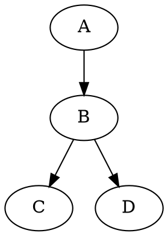

## 这是大标题

#### 这次是小标题

- nihao
  - nihao
    - nihao
      - sd

1. sda
2. fddf 

nihao[^2]


[^2]: https://github.com/

```cpp
#include <iostream>

int main()
{
    printf("Hello World!\n");

    return 0;
}
```
$1 \le n \le 10^4$

$$ \sum_{i = 0}^{10^5} f(n)$$

emoji:punch:	

- 上标：$30^th$
  
- 下标：$H_2O$
- 脚注：Content [^1]

- [ ] 这是一个测试用的

[^1]:Hi 这里是一个注脚，会自动拉到最后面排版
<table>
    <tr>
        <th rowspan="2">值班人员</th>
        <th>星期一</th>
        <th>星期二</th>
       <th>星期三</th>
    </tr>
    <tr>
        <td>李强</td>
        <td>张明</td>
        <td>王平</td>
    </tr>
</table>

st=>start: Start:>https://www.zybuluo.com
io=>inputoutput: verification
op=>operation: Your Operation
cond=>condition: Yes or No?
sub=>subroutine: Your Subroutine
e=>end

st->io->op->cond
cond(yes)->e
cond(no)->sub->io

```gantt

    title 项目开发流程
    section 项目确定
        需求分析       :a1, 2016-06-22, 1d
        可行性报告     :a2, after a1, 1d
        概念验证       :a3, after a2, 1d
    section 项目实施
        概要设计      :2016-07-05  , 5d
        详细设计      :2016-07-08, 10d
        编码          :2016-07-15, 10d
        测试          :2016-07-22, 5d
    section 发布验收
        发布: 2d
        验收: 3d
```

`sdd `


[TOC]

```cpp

```
- first
- second
- third

- first
- second
- third

[text](https://link)
1. first
2. second
3. third

- first
- second
- third:::image type="content" source="Altest2.drawio.png" alt-text="jj":::

wd
: sdsad
**sdsds**


> sds


**hsdasd**

| Column1 | Column2  | Column3   |
| ------- | -------- | --------- |
| Row1    | dfgdfgdf | dfgdfgdfg |
| Row2    | dg       | g         |
| Row3    | d        | d         |
| Row4    | d        | g         |

:::row:::
    :::column:::dfgdfgdf
        sdfdsf
    :::column-end:::
    :::column:::
        sdfsdfs
    :::column-end:::
:::row-end:::

